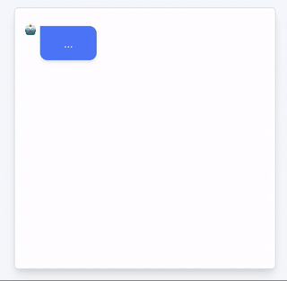

<br />
<p align="center">
  
</p>

<p align="center">
  
  
</p>

<p align="center">
  
</p>

## 🧐 Why?

Forget the boring and non-intuitive forms. With talquei you can quickly build fantastic forms as in the image above.

### [Demo](https://luciorubeens.github.io/talquei/)

## 💻 Install

Install using your package manager:

```bash
$ yarn add talquei
```

Add into your app:

```js
import Vue from 'vue'
import Talquei from 'talquei'

// import the styles 
import 'talquei/dist/talquei.min.css'

Vue.use(Talquei)
```

Or import into your component:

```js
import { Talquei, TalqueiMessage } from 'talquei'

export default {
  components: {
    Talquei,
    TalqueiMessage
  }
}
```

## ⚙️ Usage

The `Talquei` component should wrapper any `TalqueiMessage`:

```vue
<template>
  <Talquei>
    <TalqueiMessage text="Hi! My name is Talquei!" />
    <TalqueiMessage text="I'm a plugin to help you." />
  </Talquei>
</template>
```

### Request user input

You can request a user entry by prop or slot. The prop will basically inject your tag into a form and fill the entry in the `v-model`.

<details><summary>Example</summary>

```vue
<template>
  <Talquei>
    <TalqueiMessage text="What's your name?" />
    <TalqueiMessage
      v-model="name"
      :input="{ tag: 'text', placeholder: 'Enter your name' }"
      is-user
    />
  </Talquei>
</template>

<script>
export default {
  data: () => ({
    name: ''
  })
}
</script>
```
</details>

### Format user input

When the user enters the text, you can format it using the prop `template`:

<details><summary>Example</summary>

```vue
<template>
  <Talquei>
    <TalqueiMessage
      :input="{ tag: 'text', placeholder: 'Enter your name' }"
      template="My name is {text}"
      is-user
    />
  </Talquei>
</template>
```
</details>

### Predefined answers

If you need predefined answers (such as the `select` or `radio` tag) you can set `input.type = 'select'` and pass your object in the `options` field:

<details><summary>Example</summary>

```vue
<template>
  <Talquei>
    <TalqueiMessage text="Which front-end framework do you prefer?" />
    <TalqueiMessage
      v-model="name"
      :input="{ tag: 'select', options: frameworks }"
      is-user
    />
  </Talquei>
</template>

<script>
export default {
  data: () => ({
    frameworks: {
      vue: 'Vue.js',
      angular: 'AngularJS',
      ember: 'Ember.js'
    }
  })
}
</script>
```
</details>

### Conditional messages

Use when you want the `v-if` attribute to display conditional messages:

<details><summary>Example</summary>

```vue
<template>
  <Talquei>
    <TalqueiMessage text="Which front-end framework do you prefer?" />
    <TalqueiMessage
      v-model="name"
      :input="{ tag: 'select', options: frameworks }"
      is-user
    />
    <TalqueiMessage text="What plugins do you usually use in your projects?" />
    <TalqueiMessage
      v-if="answer === 'vue'"
      v-model="plugin"
      :input="{ tag: 'text', placeholder: 'talquei' }"
      is-user
    />
  </Talquei>
</template>
</script>
```
</details>

### Using slots

If you need to build more complex input (like validations, custom components) you can use slots. After the completion remeber to call the `next()` method from the `Talquei` component.

<details><summary>Example</summary>

```vue
<template>
  <Talquei ref="talquei">
    <TalqueiMessage text="Hello">
      <form @submit.stop="onSubmit">
        <input ref="input" type="text">
        <button>Ok</button>
      </form>
    </TalqueiMessage>
  </Talquei>
</template>

<script>
export default {
  methods: {
    onSubmit () {
      this.name = this.$refs.input.value
      this.$refs.talquei.next()
    }
  }
}
</script>
```
</details>

## 🔎 API

### `Talquei` component

#### Props

| Name      | Description                          | Type      | Default |
| --------- | ------------------------------------ | --------- | ------- |
| `autoRun` | Starts the conversation when mounted | `Boolean` | `true`  |

#### Slots

| Name      | Description                                                  |
| --------- | ------------------------------------------------------------ |
| `default` | Insert your `TalqueiMessage` here. Don't need a root element |

#### Methods

**`init(): void`**

Use this method to start the conversation if you set `autoRun` to `false`.

**`next(): void`**

Search the next message. Nested messages will inject this method to call when finalizing typing.

### `TalqueiMessage` component

#### Props

| Name       | Description                                         | Type      | Default       |
| ---------- | --------------------------------------------------- | --------- | ------------- |
| `input  `  | Request a user input [See details](#input-object)   | `Object`  | `undefined`   |
| `isUser`   | Define as a message written by the user             | `Boolean` | `false`       |
| `text`     | Text to be displayed, if `isUser` will not be typed | `String`  | `undefined`   |
| `value`    | Useful only for use in `v-model`                    | `String`  | `undefined`   |
| `template` | Formats user input                                  | `String`  | `{text}`      |

##### `input` object

Will create a basic form from the `tag` informed, should not be defined if you prefer to use the slot.

- `tag`: Valid tags are currently `text` or `select`.
- `options` (`select`):  Use this field to define an `object` with the available options.
- `placeholder` (`text`): Set the placeholder of your input field.
- `type` (`text`): Set the type of your input field. Default is `text`.

#### Slots

| Name      | Description                                                  |
| --------- | ------------------------------------------------------------ |
| `default` | Use this if you need more complex or personalized user input |
| `avatar`  | Change the element used as avatar. Default is "🤖"           |

## 🤝 Contribute

If you want to contribute to this project, please see our [Contributing Guide](/.github/CONTRIBUTING.md).
